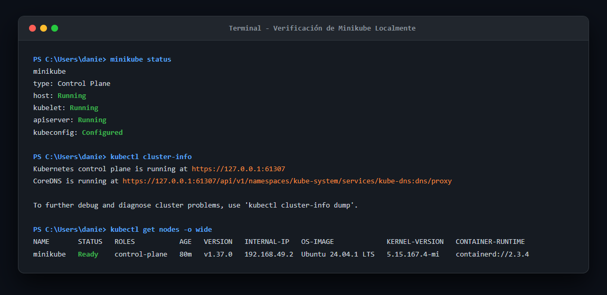
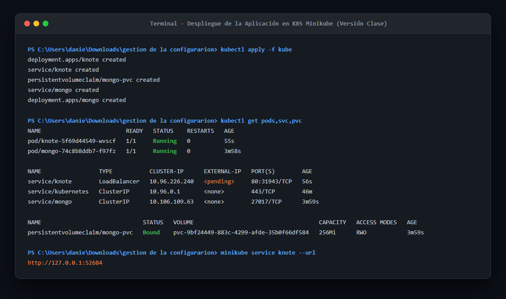
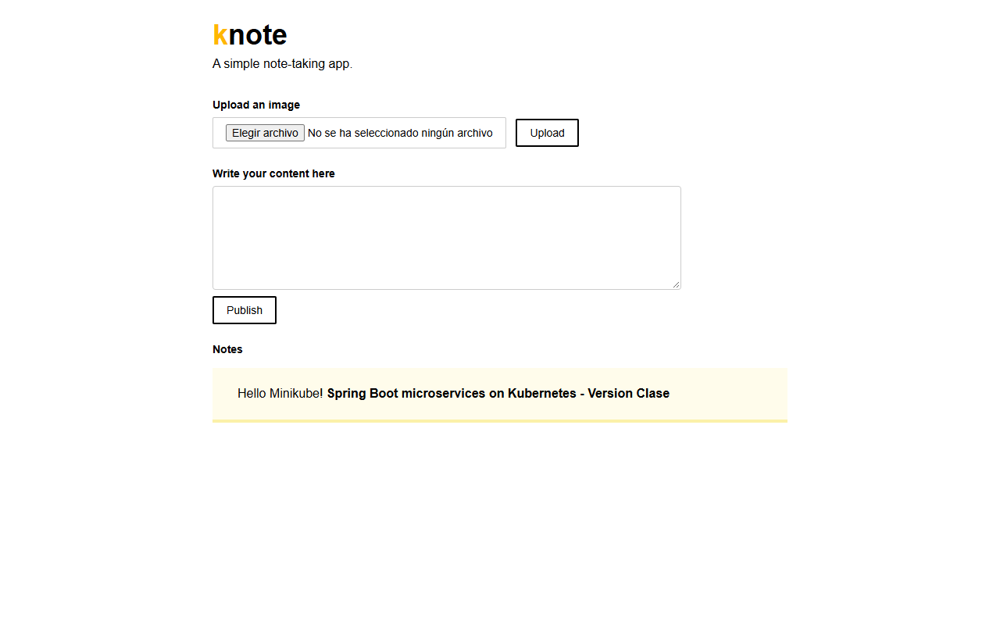
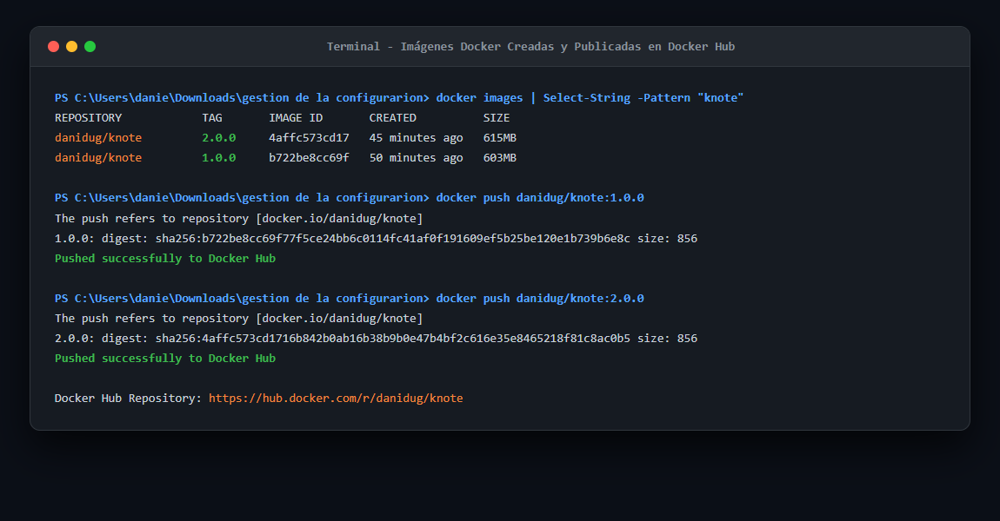
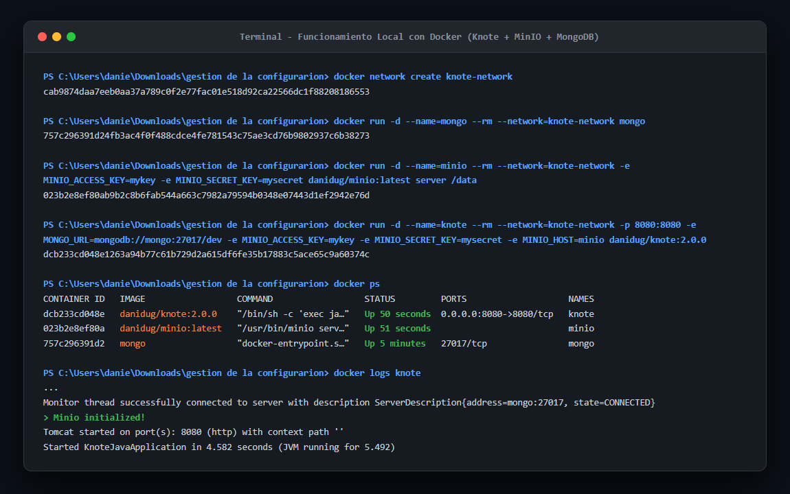
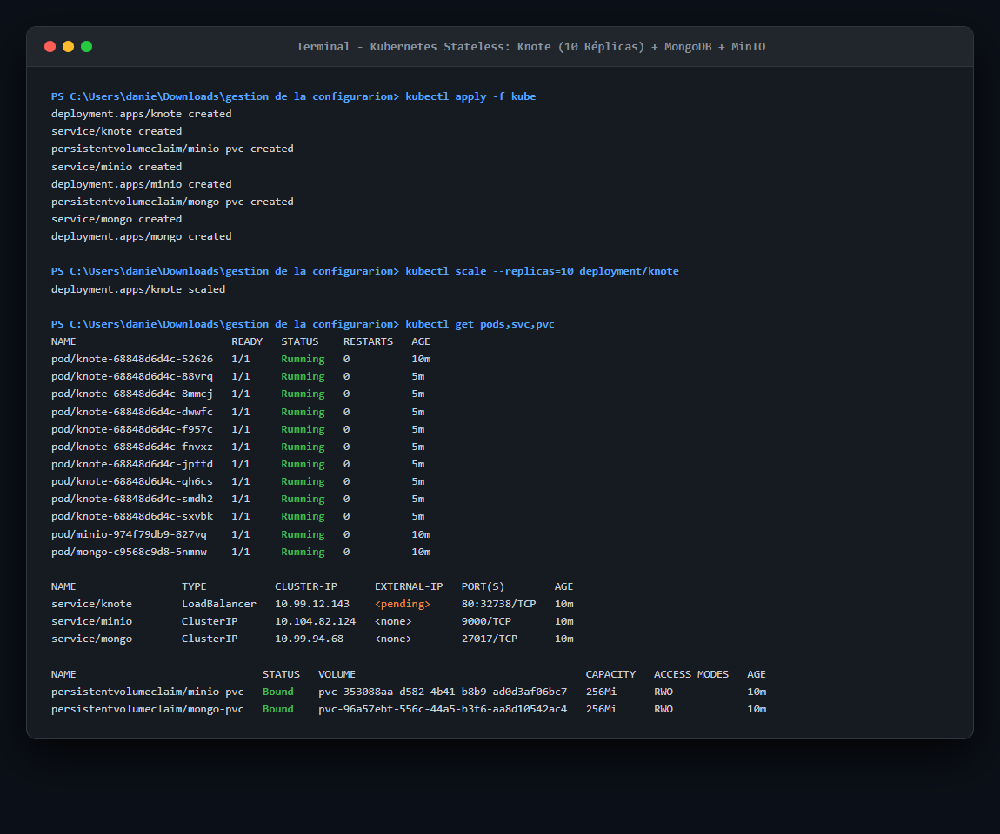
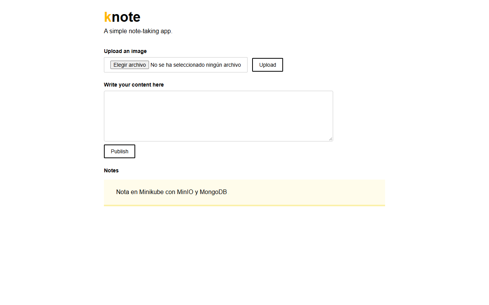

# Knote - Spring Boot en Kubernetes (Stateless con MongoDB y MinIO)

**Autor:** Daniel Duque  
**GitHub:** [DANN-Du](https://github.com/DANN-Du)  
**Repositorio GitHub:** [https://github.com/DANN-Du/knote-java](https://github.com/DANN-Du/knote-java)  
**DockerHub:** [https://hub.docker.com/r/danidug/knote](https://hub.docker.com/r/danidug/knote)  

Este repositorio contiene la aplicación **Knote**, una aplicación de notas desarrollada en **Spring Boot** desplegada sobre **Kubernetes (Minikube)** siguiendo una arquitectura desacoplada y sin estado (**stateless**).

---

## 🏛️ Arquitectura del Sistema

La aplicación está diseñada para ser completamente escalable y sin estado:
1. **Frontend / API (`knote`):** Microservicio Spring Boot que gestiona las notas en Markdown y la carga de imágenes. Expuesto mediante un Service tipo `LoadBalancer`.
2. **Base de Datos (`mongo`):** MongoDB con almacenamiento persistente (`PersistentVolumeClaim`) para almacenar el texto de las notas en formato Markdown renderizado a HTML.
3. **Almacenamiento de Objetos (`minio`):** MinIO S3-compatible con almacenamiento persistente (`PersistentVolumeClaim`) para almacenar de forma centralizada todas las imágenes subidas.
4. **Orquestador:** Kubernetes (Minikube).

```
         +----------------------------------+
         |         Usuario / Cliente        |
         +-----------------+----------------+
                           |
                     (HTTP Port 80)
                           v
               +-----------------------+
               |  Service: knote (LB)  |
               +-----------+-----------+
                           |
             +-------------+-------------+
             |                           |
             v                           v
     +---------------+           +---------------+
     |  Pod: knote-1 |   ...     |  Pod: knote-N | (Escalable a 10+ réplicas)
     +-------+-------+           +-------+-------+
             |                           |
       +-----+-----+               +-----+-----+
       |           |               |           |
(Texto)|           |(Fotos)  (Texto)|          |(Fotos)
       v           v               v           v
+--------------+ +---------------+--------------+ +---------------+
| MongoDB (db) | | MinIO (s3)    | MongoDB (db) | | MinIO (s3)    |
| Port: 27017  | | Port: 9000    | Port: 27017  | | Port: 9000    |
+--------------+ +---------------+--------------+ +---------------+
```

---

## 🚀 Versiones de la Aplicación (Docker Hub)

- **`danidug/knote:1.0.0`**: Versión inicial stateful desarrollada en clase, donde las imágenes se guardaban localmente en el sistema de archivos del contenedor.
- **`danidug/knote:2.0.0`**: Versión stateless que integra el cliente de MinIO (`io.minio:minio:6.0.8`) para persistir las imágenes en un bucket centralizado (`image-storage`).

Docker Hub Repository: **[https://hub.docker.com/r/danidug/knote](https://hub.docker.com/r/danidug/knote)**

---

## 📸 Evidencias de Entrega

### 1. Funcionamiento de Minikube localmente


---

### 2. Funcionamiento de la aplicación corriendo dentro de K8S (Minikube) - Versión de Clase
#### Despliegue de Pods, Servicios y PVCs en Minikube:


#### Aplicación Knote corriendo en el navegador con nota persistida en MongoDB:


---

### 3. Repositorio de GitHub con soporte para MinIO
- **Link del Repositorio:** [https://github.com/DANN-Du/knote-java](https://github.com/DANN-Du/knote-java)

---

### 4. Repositorio de Docker Hub con las imágenes creadas
- **Link de DockerHub:** [https://hub.docker.com/r/danidug/knote](https://hub.docker.com/r/danidug/knote)
- **Imágenes disponibles:**
  - `danidug/knote:1.0.0`
  - `danidug/knote:2.0.0`



---

### 5. Funcionamiento de la App Local con los cambios realizados (MinIO)
#### Despliegue local con Docker (Knote + MinIO + MongoDB):


#### Aplicación Knote local con nota e imagen alojada en MinIO:


---

### 🌟 Bonus: Escalabilidad Stateless en Kubernetes (10 Réplicas)
Al migrar el almacenamiento de imágenes a MinIO, la aplicación se vuelve completamente stateless, permitiendo escalar a 10 réplicas sin inconsistencias:


#### Aplicación corriendo con 10 réplicas accediendo a MinIO:


---

## 🛠️ Despliegue en Kubernetes (Minikube)

### 1. Iniciar Minikube
```bash
minikube start --driver=docker
```

### 2. Desplegar los componentes
```bash
kubectl apply -f kube
```

Los manifiestos ubicados en la carpeta `kube/` incluyen:
- `mongo.yaml`: PVC (`mongo-pvc`), Service (`mongo:27017`) y Deployment de MongoDB.
- `minio.yaml`: PVC (`minio-pvc`), Service (`minio:9000`) y Deployment de MinIO con almacenamiento persistente.
- `knote.yaml`: Service (`knote:80`) y Deployment de la aplicación usando `danidug/knote:2.0.0` con variables de entorno para conexión a Mongo y MinIO.

### 3. Verificar estado de los Pods y Servicios
```bash
kubectl get pods
kubectl get svc
kubectl get pvc
```

### 4. Acceder a la aplicación
```bash
minikube service knote
```

### 5. Probar escalabilidad (Stateless)
Al escalar la aplicación a 10 réplicas, las imágenes permanecen visibles sin importar a qué réplica llegue la petición HTTP, garantizando statelessness:
```bash
kubectl scale --replicas=10 deployment/knote
kubectl get pods -l app=knote
```

---

## 💻 Ejecución Local con Docker

Para correr la versión completa de forma local utilizando contenedores Docker independientes:

```bash
# 1. Crear red de Docker
docker network create knote-network

# 2. Iniciar MongoDB
docker run -d --name=mongo --rm --network=knote-network mongo

# 3. Iniciar MinIO
docker run -d --name=minio --rm --network=knote-network \
  -e MINIO_ACCESS_KEY=mykey \
  -e MINIO_SECRET_KEY=mysecret \
  danidug/minio:latest server /data

# 4. Iniciar Knote
docker run -d --name=knote --rm --network=knote-network \
  -p 8080:8080 \
  -e MONGO_URL=mongodb://mongo:27017/dev \
  -e MINIO_ACCESS_KEY=mykey \
  -e MINIO_SECRET_KEY=mysecret \
  -e MINIO_HOST=minio \
  danidug/knote:2.0.0
```
Abrir `http://localhost:8080` en el navegador.
